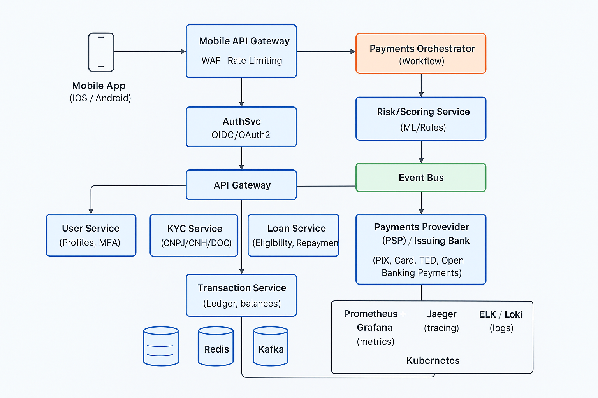

# Fintech Platform



## Visão Geral

Este repositório contém o **desenho arquitetural e plano técnico** de uma plataforma **fintech** moderna, projetada para oferecer:
- Cadastro de usuários via aplicativo mobile  
- Integração com bases governamentais e open finance  
- Solicitação e gerenciamento de empréstimos  
- Emissão e recebimento de pagamentos automatizados  

A solução foi desenhada para ser **escalável, resiliente e observável**, com foco em **segurança e modularidade**.

---

## Arquitetura de Alto Nível

**Camadas principais:**
- **Frontend (Mobile/Web)** → Flutter / React Native  
- **API Gateway** → NGINX / Kong / AWS API Gateway  
- **Backend (Microserviços)** → Laravel / Node.js / NestJS  
- **Banco de Dados** → PostgreSQL (relacional)  
- **Cache e Filas** → Redis + RabbitMQ / Kafka  
- **Monitoramento** → Prometheus / Grafana / ELK Stack  
- **Infraestrutura** → Docker / Kubernetes / Terraform  

## ATENÇÃO:
Leia sobre a estrutura do projeto em [`docs/Projeto_Fintec_LeadTech.pdf`](docs/Projeto_Fintec_LeadTech.pdf)

Leia sobre motivo do Backend do projeto em Laravel em [`docs/Projeto_KYC_Fintec_Laravel.pdf`](docs/Projeto_KYC_Fintec_Laravel.pdf)

Veja o diagrama do projeto em [`docs/Diagrama_Arquitetura_Fintech.png`](docs/Diagrama_Fintec.png)

---

## Estrutura do Projeto

```bash
.
├── src/
│   ├── api-gateway/
│   │   ├── index.js
│   │   ├── package.json
│   │   └── routes.js
│   ├── auth-service/
│   │   └── AuthController.php
│   ├── user-service/
│   │   └── UserController.php
│   ├── loan-service/
│   │   └── LoanController.php
│   ├── payment-service/
│   │   └── PaymentController.php
│   └── integration/
│       ├── ReceitaFederalAPI.php
│       ├── OpenFinanceAPI.php
│       └── CnhRgValidation.php
│
├── docker/
│   ├── Dockerfile
│   └── docker-compose.yml
│
├── .github/
│   └── workflows/
│       └── ci-cd.yml
│
├── tests/
│   ├── unit/
│   ├── integration/
│   └── e2e/
│
├── docs/
│   ├── Diagrama_Fintec.png
│   ├── Projeto_Fintec_LeadTech.pdf
│   └── Projeto_KYC_Fintec_Laravel.pdf
│
└── README.md

```

## Fluxo de CI/CD — Integração Contínua e Entrega Contínua

O projeto utiliza **GitHub Actions** para automatizar todo o ciclo de desenvolvimento: **Build**, **Test** e **Deploy**.

### Diagrama do Pipeline CI/CD

### 🔄 Diagrama do Pipeline CI/CD

```mermaid
flowchart LR
    A["Commit / Push"] --> B["GitHub Actions CI Trigger"]
    B --> C["Build: Docker Compose"]
    C --> D["Testes Automatizados"]
    D --> E{"Testes OK?"}
    E -- "Não" --> F["Notificar Falha no Workflow"]
    E -- "Sim" --> G["Deploy Automatizado"]

    G --> H["Ambiente de Homologação (Staging)"]
    H --> I["Testes E2E e Smoke Tests"]
    I --> J{"Aprovado para Produção?"}
    J -- "Não" --> F
    J -- "Sim" --> K["Deploy em Produção"]

    K --> L["Serviço Online"]

    style A fill:#6ee7b7,stroke:#047857,stroke-width:2px
    style B fill:#93c5fd,stroke:#1e3a8a,stroke-width:2px
    style C fill:#a5b4fc,stroke:#312e81,stroke-width:2px
    style D fill:#fde68a,stroke:#92400e,stroke-width:2px
    style G fill:#bbf7d0,stroke:#166534,stroke-width:2px
    style K fill:#86efac,stroke:#15803d,stroke-width:2px

